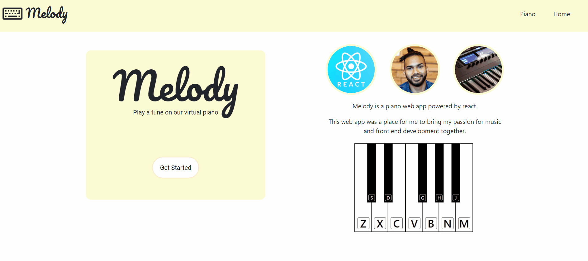

# Melody
> - Maintained by: `kusholhuq`
## Description
A responsive virtual piano application with keyboard and click/tap functionality.


## Live Demo
https://melody.kusholhuq.com

## Features
1. Users can play one octave of piano keys
2. Users can play keys with their keyboard
3. Users can play keys with click/tap
4. The application is mobile-responsive for iPhone and iPad

## Technologies Used
* React.js
* HTML5
* CSS3
* AWS EC2

## Preview



## Getting Started
#### 1. Clone the repository and navigate to the directory
```shell
git clone https://github.com/kusholhuq/piano-front-end.git
cd piano-front-end
```

#### 2. Install all dependencies
```shell
npm install
```

#### 3. Compile project
```shell
npm run start
```

#### 4. Access application by entering [https://localhost:3000](https://localhost:3000) in the browser.
